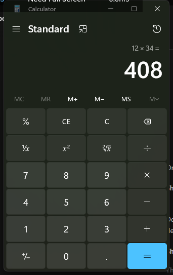

# windows-cua-jev

An agent that operates Windows desktop apps for about a tenth of a cent per task. It reads the UI Automation tree as indexed text and asks a small model to make one typed decision per step. It never sends a screenshot unless you ask for one.

I built this after running screenshot-based computer use loops and getting tired of the bill. Windows already publishes a machine-readable description of every app's UI; the accessibility tree is just text. Feeding that text to a cheap model works better than I expected, and it costs two orders of magnitude less than screenshot + vision loops.



## How a step works

1. `get-tree.ps1` reads the target window's UIA tree and prints an indexed action space: one element per line, with control type, name, and current value.
2. The decision model sees the goal, the tree, and a short history of actions already taken. It must answer with one line of JSON: `{"op":"click|type|key|done|fail","index":N,"text":"...","reason":"..."}`.
3. `act.ps1` validates the decision against the current tree and executes it through UIA patterns (Invoke, Toggle, SelectionItem, ExpandCollapse) with a raw mouse-event fallback.
4. The tree is re-read. Repeat until the model answers `done`.

If the cheap model returns garbage, an empty response, or invalid JSON, the same prompt goes to a larger backup model. You'll see `[escalated: ...]` lines in the output when that happens; it is normal.

## Numbers from actual runs

About 50 logged decisions from a day of testing on my desktop (Ryzen box, Windows 11, OpenRouter). Decider: glm-4.7-flash, backup: gpt-oss-120b.

### Speed

| Metric | Result |
|---|---|
| Median decision latency | ~5s |
| Fastest decision observed | 1.3s |
| Full 12-step Calculator task, wall clock | under a minute |
| Input per step | ~1.0-1.5K text tokens (tree + goal + history) |
| Output per step | ~30-80 tokens |

### Cost

| Metric | Result |
|---|---|
| Per decision | ~$0.0001 |
| Per 12-step task | ~$0.0012 |
| Per 1,000 tasks | ~$1.20 |
| Per 100K steps/month | ~$10 |
| Pricing basis | $0.0605/M input tokens, queried from OpenRouter 2026-09 |

### Against screenshot-based loops

A screenshot + frontier vision LLM loop (illustrative figures; check current pricing) runs $0.005-0.015 per step once you count image tokens and the longer prompts those loops need:

| Screenshot loop | windows-cua-jev |
|---|---|
| 1x | **1/50th to 1/150th the cost** |
| ~$75 for 1,000 tasks/day | ~$1.20 |
| Vision-model latency every step | text-tree steps, no pixels |

TypeSafe claims 40-400x cheaper than LLMs for Jev itself; if you get a key, this repo's happy path inherits that discount by changing one environment variable.

### Reliability

| Metric | Result |
|---|---|
| Cheap decider first-try valid decision (latest engine revision, small sample) | 11 of 12 (92%) |
| Escalated steps that still produced a working decision | every one in our logs |

### Decider head-to-head: glm-5.3-flash vs glm-4.7-flash

Three identical goals against the same Calculator window, run back to back on OpenRouter:

| | glm-5.3-flash | glm-4.7-flash |
|---|---|---|
| Valid JSON decision returned | 3 of 3 | 2 of 3 (one empty response, escalated) |
| Latency | 1.9s / 3.2s / 6.5s | 3.6s / 9.7s / (escalated) |
| Decision quality | picked the efficient action each time, including falling back to raw keystrokes when the tree was empty | weaker judgment, one pointless `fail` |
| Price (input, queried 2026-09) | $0.09/M | $0.0605/M |

glm-5.3-flash is the better decider for ~1.5x the price, and both are so cheap that the difference is rounding error; the default in `cua.mjs` is 4.7-flash if you want the absolute floor, set `CUA_JEV_MODEL=z-ai/glm-5.3-flash` if you want fewer escalations. The two `fail` decisions above were correct calls: the Calculator tree went empty mid-benchmark, and declining to act on a broken tree is the right answer.

The catch, stated plainly: the cheap model is dumber. Over a long run it will sometimes miscount ("enter digit 8", clicks 7), repeat a step, or return truncated JSON. The history feedback and backup escalation catch most of it, but I would not run this unsupervised on anything that matters yet.

## Setup

Windows 10/11, Node 18+, PowerShell 5.1 (already on Windows). Nothing to install. No npm packages.

```powershell
git clone https://github.com/foklepoint/windows-cua-jev
cd windows-cua-jev

$env:CUA_API_KEY      = "sk-or-v1-..."       # or reuse OPENROUTER_API_KEY
$env:CUA_JEV_MODEL    = "z-ai/glm-4.7-flash" # the cheap decider
$env:CUA_BACKUP_MODEL = "openai/gpt-oss-120b"

node cua.mjs tree --window Notepad
node cua.mjs run  --goal "Type 'hello world' into the text editor" --window Notepad --steps 6
```

### CLI

| Command | What it does |
|---|---|
| `tree --window <substr>` | Print the indexed element list for a window |
| `act --index N --action click\|type\|key\|read [--text T] [--window W]` | Run one action |
| `decide --goal G [--window W]` | Ask for one decision, execute nothing |
| `run --goal G [--window W] [--steps N]` | Autonomous decide, act, re-observe loop |
| `shot [--window W] [--path P]` | Screenshot, cropped to a window if you pass one |

## Picking a model pair

The engine speaks plain OpenAI-compatible `/chat/completions`, so any of these work by setting environment variables:

| Setup | Env vars |
|---|---|
| OpenRouter (default, cheapest working pair I found) | `CUA_BASE_URL=https://openrouter.ai/api/v1`, `CUA_API_KEY`, models above |
| TypeSafe Jev, early access from [typesafe.ai](https://typesafe.ai) | `CUA_BASE_URL=https://api.typesafe.ai/v1` if their endpoint is OpenAI-compatible; `CUA_API_KEY`, `CUA_JEV_MODEL=jev-1` |
| Jev behind a [LiteLLM](https://github.com/BerriAI/litellm) proxy (works even if their API shape differs) | point `CUA_BASE_URL` at your proxy |
| Ollama, fully local | `CUA_BASE_URL=http://localhost:11434/v1`, `CUA_JEV_MODEL=qwen3:4b` |

`OPENROUTER_API_KEY` works in place of `CUA_API_KEY`.

## Use it from opencode, Claude Desktop, or Cursor

Copy `opencode/plugins/cua.ts` into your project's `.opencode/plugins/` and `opencode/skills/windows-cua/` into `.opencode/skills/`. The agent then gets `cua_tree`, `cua_act`, `cua_decide`, `cua_run`, and `cua_screenshot` as native tools, and the skill teaches it the right order to use them. The plugin shells out to `cua.mjs`, so keep the repo somewhere on disk.

For any MCP client, there is a stdio server with no dependencies:

```json
{
  "mcpServers": {
    "windows-cua-jev": {
      "command": "node",
      "args": ["C:\\path\\to\\windows-cua-jev\\mcp-server.mjs"],
      "env": {
        "CUA_API_KEY": "sk-or-v1-...",
        "CUA_JEV_MODEL": "z-ai/glm-4.7-flash",
        "CUA_BACKUP_MODEL": "openai/gpt-oss-120b"
      }
    }
  }
}
```

## Where it breaks

- Apps must expose UIA. Most Win32, WinForms, WPF, WinUI, and browser accessibility trees do. Games and canvas-only apps do not, and this repo has no screenshot-driven mode.
- Popups shift element indices. The engine re-reads the tree every step, which handles most of it, but if an error dialog is sitting over your app you will chase ghosts. Dismiss dialogs first.
- WinUI apps (Calculator, at least on my build) report NaN rectangles for some elements and intermittently mis-execute rapid InvokePattern clicks; I saw `1,234 x 5,678` return `7,006,652` twice in a row with correct operand readbacks, then `12 x 34 = 408` work fine. I have not root-caused it. Elements with broken rects show as `(-1,-1,-1x-1)`.
- `key` uses global SendKeys and types into whatever has focus. On a desktop you are actively using, that is a great way to type garbage into your own windows. Prefer `click` actions, which use UIA and do not steal focus.
- Decisions are per-step and stateless apart from a 10-action history. Long chains of dependent steps are where the cheap model falls apart; supervise those or use a stronger decider.

## Related work

- [browser-use/jev-ultrafast](https://github.com/browser-use/jev-ultrafast) - the same indexed-action-space idea for browsers, where I copied the pattern from
- [TypeSafe AI Jev](https://typesafe.ai) - the decision model this repo is named after
- [CursorTouch/Windows-MCP](https://github.com/CursorTouch/Windows-MCP) - a heavier Windows MCP server, worth a look if you want more tools

MIT licensed. Not affiliated with TypeSafe AI or browser-use; the name refers to the pattern, not their model.
